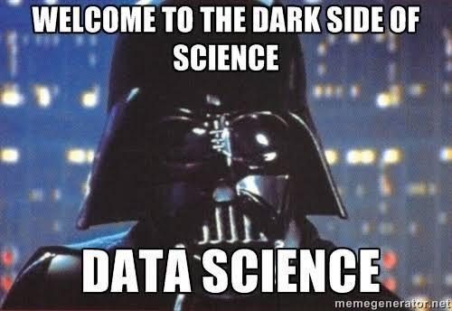

# Diabetes-EDA-Ml

This project focuses on analyzing the Diabetes dataset, which includes data from a total sample of 768 Indian women. The dataset comprises information about individuals with and without diabetes. The analysis is conducted using the Python programming language in Jupyter Notebook.

**Dataset Overview**

The dataset consists of 768 samples of Indian women.
Each sample includes various features such as age, BMI (Body Mass Index), blood pressure, and glucose levels, among others.
The target variable is the presence or absence of diabetes.

**Project Objective**

The primary objective of this project is to compare the efficiency of five machine learning models in predicting diabetes based on the provided dataset. The following machine learning models were employed:

- Linear Regression
- K-Nearest Neighbors (KNN)
- Decision Tree
- Random Forest
- Support Vector Machine (SVM)

**Methodology**

Data Preprocessing: The dataset was preprocessed by handling missing values, scaling numerical features, and encoding categorical variables as necessary.
Model Training: Each machine learning model was trained on the preprocessed data using appropriate algorithms and settings.
Model Evaluation: The trained models were evaluated using accuracy scores to measure their performance in predicting diabetes.
Comparison: The accuracy scores of all five models were compared to determine their relative efficiency in predicting diabetes.

**Results**

Based on the analysis, the accuracy scores for the different machine learning models on the Diabetes dataset were as follows:

- Linear Regression: 0.741
- K-Nearest Neighbors (KNN): 0.662
- Decision Tree: 0.633
- Random Forest: 0.719
- Support Vector Machine (SVM): 0.719

The Linear Regression model achieved the highest accuracy score among the models evaluated, indicating its better performance in predicting diabetes compared to the others.

**Conclusion**

In conclusion, this project focused on comparing the efficiency of five machine learning models in predicting diabetes using the provided Diabetes dataset. The analysis revealed that Linear Regression exhibited the highest accuracy score, suggesting its effectiveness in predicting the presence or absence of diabetes. The other models, namely KNN, Decision Tree, Random Forest, and SVM, also provided insights into diabetes prediction but were comparatively less accurate.

The project primarily revolves around utilizing multiple machine learning models to predict diabetes based on the given dataset. The findings and comparisons can serve as a foundation for further research and improvement in diabetes prediction models.

For detailed implementation and code, please refer to the Jupyter Notebook file in this repository.

Enjoy the exploration and ....

